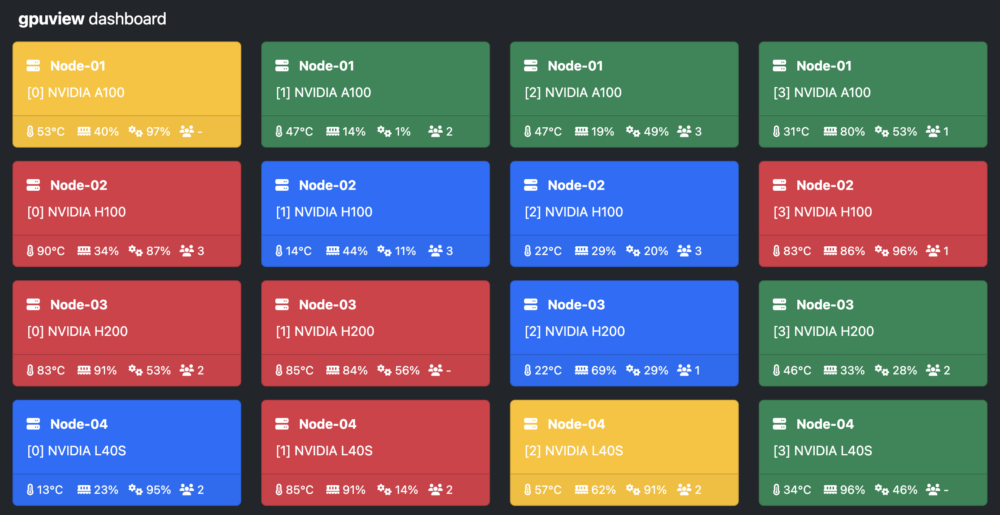
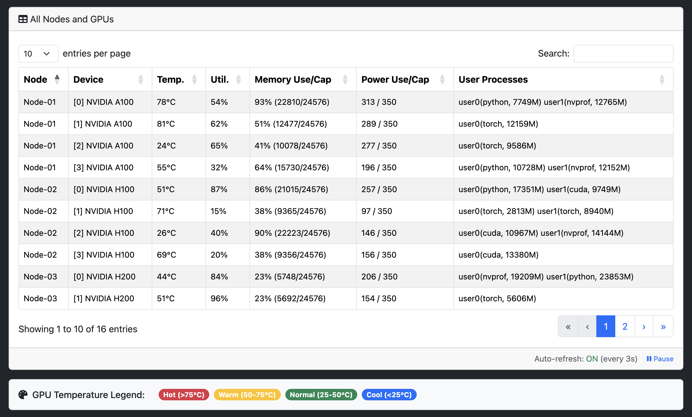

# gpuview

[](https://github.com/fgaim/gpuview/blob/master/LICENSE)

[](https://pypi.org/project/gpuview/)
[](https://pypi.org/project/gpuview/)
[](https://circleci.com/gh/fgaim/gpuview)

GPU is an expensive resource, and deep learning practitioners have to monitor the health and usage of their GPUs, such as the temperature, memory, utilization, and the users. This can be done with tools like `nvidia-smi` and `gpustat` from the terminal or command-line. Often times, however, it is not convenient to `ssh` into servers to just check the GPU status. `gpuview` is meant to mitigate this by running a lightweight web dashboard on top of [`gpustat`][repo_gpustat].

With `gpuview` one can monitor GPUs on the go, through a web browser. Moreover, **multiple GPU servers** can be registered into one `gpuview` dashboard and all stats are aggregated and accessible from one place.

The dashboard features **live auto-refresh** (every 3 seconds) and includes interactive tooltips, temperature-based color coding, and pause/resume controls for real-time GPU monitoring.

Dashboard view of nine GPUs across multiple servers:



## Setup

Python 3.9 or higher is required.

Install from [PyPI][pypi_gpuview]:

```sh
pip install gpuview
```

[or] Install directly from repo:

```sh
pip install git+https://github.com/fgaim/gpuview.git@main
```

> `gpuview` installs the latest version of `gpustat` from `pypi`, therefore, its commands are available from the terminal.

## Usage

`gpuview` can be used in two modes as a temporary process or as a background service.

### Run gpuview

Once `gpuview` is installed, it can be started as follows:

```sh
gpuview run --safe-zone
```

This will start the dashboard at `http://0.0.0.0:9988`.

By default, `gpuview` runs at `0.0.0.0` and port `9988`, but these can be changed using `--host` and `--port`. The `safe-zone` option means report all details including usernames, but it can be turned off for security reasons.

For testing and development purposes, you can run gpuview with synthetic data:

```sh
gpuview run --demo
```

This displays fake GPU statistics and is useful when developing on systems without NVIDIA GPUs or when showcasing the dashboard.

### Run as a Service

On **Linux systems with systemd** (which is standard on most modern distributions like Ubuntu, RHEL, and Fedora), you can install `gpuview` to run as a permanent background service. This requires `sudo` privileges.

**1. Install & Start the Service:**  
Run the `start` command. The first time you run this, it will also **install** the service. For backward compatibility, `gpuview service` (with no subcommand) defaults to `start`.

```sh
# Install and start the service with defaults settings
gpuview service --safe-zone

# Or apply custom configurations
gpuview service start [--host <ip>] [--port <port>] [--safe-zone] [--exclude-self]
```

The service will be configured with the options you provide (like `--port`) and set to autostart on boot.

**2. Manage the Service:**
You can easily control the service with these built-in commands:

* `gpuview service status`: Check if the service is running and see its recent logs.
* `gpuview service logs`: View real-time service logs using journalctl.
* `gpuview service stop`: Stop the background service.
* `gpuview service start`: Start the service if it's been stopped (it will not re-install).
* `gpuview service delete`: Stop, disable, and **uninstall** the service from your system.

### Runtime options

There are a few important options in `gpuview`, use `gpuview --help` to see them all.

```sh
gpuview -h
```

* `run` : Start `gpuview` dashboard server
  * `--host` : URL or IP address of host (default: 0.0.0.0)
  * `--port` : Port number to listen to (default: 9988)
  * `--safe-zone` : Safe to report all details, eg. usernames
  * `--exclude-self` : Don't report to others but to self-dashboard
  * `--demo` : Run with fake data for testing purposes
  * `-d`, `--debug` : Run server in debug mode (for developers)
* `add` : Add a GPU host to the dashboard
  * `--url` : URL of host [IP:Port], eg. X.X.X.X:9988
  * `--name` : Optional readable name for the host, eg. Node101
* `remove` : Remove a registered host from dashboard
  * `--url` : URL of host to remove, eg. X.X.X.X:9988
* `hosts` : Print out all registered hosts
* `service` : Manage the `gpuview` systemd service (Linux only). Defaults to 'start'.
  * `start` : Install (if needed) and start the service.
    * `--host` : (Optional) Host to bind (default: 0.0.0.0)
    * `--port` : (Optional) Port to bind (default: 9988)
    * `--safe-zone` : (Optional) Report all details, eg. usernames
    * `--exclude-self` : (Optional) Don't report to others
  * `status` : Check the status of the `gpuview` service.
  * `stop` : Stop the `gpuview` service.
  * `logs` : View service logs using journalctl.
  * `delete` : Stop, disable, and uninstall the service.
* `-v`, `--version` : Print versions of `gpuview` and `gpustat`
* `-h`, `--help` : Print help for command-line options

### Monitoring multiple hosts

To aggregate the stats of multiple machines, they can be registered to one dashboard using their address and the port number running `gpustat`.

Register a host to monitor as follows:

```sh
gpuview add --url <ip:port> --name <name>
```

Remove a registered host as follows:

```sh
gpuview remove --url <ip:port> --name <name>
```

Display all registered hosts/nodes as follows:

```sh
gpuview hosts
```

The `gpuview` service needs to run in all hosts that will be monitored.

> Tip: `gpuview` can be setup on a none GPU machine, such as laptops, to monitor remote GPU servers.

## API Endpoints

gpuview provides REST API endpoints for programmatic access:

* `GET /api/gpustat/self` - Returns GPU statistics for the main host
* `GET /api/gpustat/all` - Returns aggregated GPU statistics for all registered hosts

**Legacy endpoints:**

* `GET /gpustat` - Returns GPU statistics for the local host (backward compatibility)

## Etc

Helpful tips related to the underlying performance are available at the [`gpustat`][repo_gpustat] repo.

For the sake of simplicity, `gpuview` does not have a user authentication in place. As a security measure,
it does not report sensitive details such as user names by default. This can be changed if the service is
running in a trusted network, using the `--safe-zone` option to report all details.

The `--exclude-self` option of the run command can be used to prevent other dashboards from getting stats of the current machine. This way the stats are shown only on the host's own dashboard.

Detailed view of GPUs across multiple servers:



## License

`gpuview` is licensed under the [MIT License](LICENSE), which is a permissive open-source license that allows you to freely use, modify, and distribute this software.

[repo_gpustat]: https://github.com/wookayin/gpustat
[pypi_gpuview]: https://pypi.python.org/pypi/gpuview
